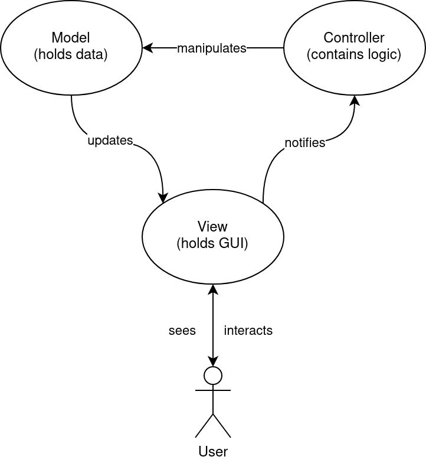

# Software Structure

```{toctree}
:maxdepth: 1
:caption: Contents:

modules
communication
development
```

## Introduction

To allow for easy modification and expansion of the NQRduck software, the architecture was designed accordingly. 

Functionality is implemented in different modules that can be developed independently of each other. This allows for an independent implementation of the different functionality and makes it less likely for bugs to be  introduced into the core application. The  modular approach also allows for easy implementation of new modules  without in-depth knowledge of the core program or other modules. 

Individual features of the software can be installed as separate Python packages, like spectrometer control, pulse sequence programming or simulation of magnetic resonance experiments. The available functionality of the NQRduck program therefore depends on the installed packages.

## Model-View-Controller Architecture

The Model-View-Controller (MVC) architecture is a widely established programming pattern for user interfaces. In the MVC architecture the application data is represented in a *Model* object, the Graphical User Interface (GUI) in a *View* object and the user input is processed by the *Controller* object {cite:p}`Gamma2011`. 

|  |
|:--:| 
|Figure: Principle behind the MVC architecture. Figure adapted from {cite:p}`mvcwiki`.|

For the NQRduck a hierarchical MVC architecture was chosen. More information can be found in the [modules](modules.md) section.