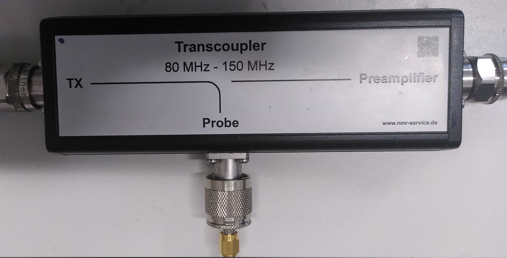

# Transcoupler
The Transcoupler is used as a passive TX-RX switch. 

|  |
|:--:|
| Figure: Picture of the Transcoupler.

It has three different connections:
- TX: Which is usually connected to the OUT port of the Directional Coupler.
- Probe: Which is usually connected to the Probe Coil.
- Preamplifier: Which is usually connected to the LNA. 